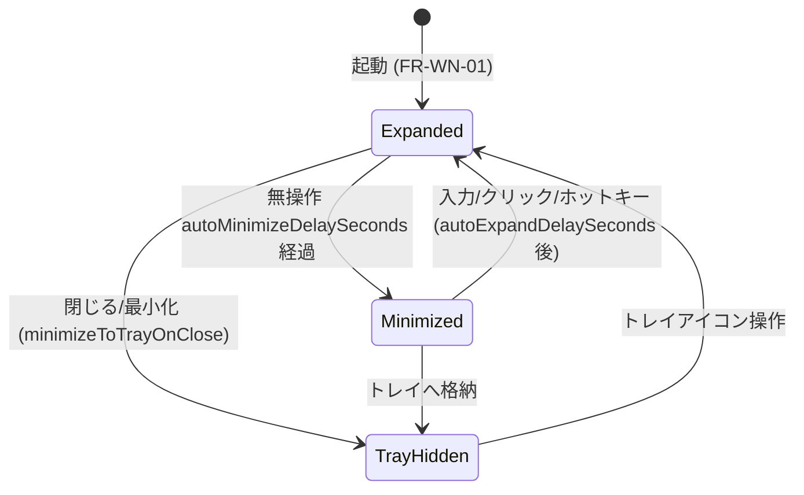
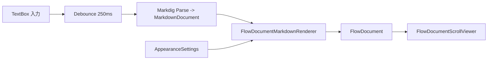

# MDAsisst アーキテクチャ設計書

- 文書ID: ARC-MDAsisst
- 版数: 2.0
- 最終更新: 2026-08-05
- 参照: `docs/requirements.md`, `docs/adr/`

---

## 1. 設計方針

1. **レイヤー分離**: ドメインロジック（レンダリング／補完／状態遷移／設定）を WPF から切り離し、単体テスト可能にする。
2. **設定値を外出し**: 透過度・タイマー値・色などは一切ハードコードせず `settings.json` と既定値クラスに集約する。
3. **異常を握りつぶさない**: ファイルI/O・更新確認は必ず try-catch し、ログに理由を残す。UI は縮退動作する。
4. **オフライン第一**: 起動〜編集〜保存の全経路でネットワークに依存しない。通信は更新確認のみ。
5. **メモリ最小**: 追加ランタイムなし、遅延生成、非表示時のリソース解放を徹底する。

## 2. ソリューション構成

```
MDAsisst.sln
├── src/
│   ├── MDAsisst.Core/           # ドメインモデル・インターフェース（WPF非依存）
│   │   ├── Settings/            # AppSettings, 既定値, ISettingsService
│   │   ├── Snippets/            # SnippetItem, CheatSheetCategory, ICheatSheetProvider
│   │   ├── Editing/             # 入力支援ロジック（リスト継続・装飾トグル）
│   │   ├── WindowState/         # 自動表示/自動最小化の状態機械（UI非依存）
│   │   └── Logging/             # ILogSink, ファイルロガー
│   ├── MDAsisst.Rendering/      # Markdig AST → FlowDocument レンダラ
│   ├── MDAsisst.Updating/       # Velopack ラッパー（IUpdateService）
│   ├── MDAsisst.App/            # WPF（Views / ViewModels / トレイ / 設定画面）
│   └── MDAsisst.Tests/          # xUnit（Core / Rendering / Updating）
├── docs/                        # MD駆動設計ドキュメント（唯一の設計正）
├── installer/                   # Velopack パック用スクリプト
└── .github/workflows/           # CI（ビルド・テスト）／リリース
```

依存方向は `App → Rendering/Updating → Core` の一方向。Core は他のいずれにも依存しない。

## 3. モジュール責務

| モジュール | 責務 | 主要型 |
| --- | --- | --- |
| Core.Settings | 設定モデル・永続化・破損時の退避と既定値復帰 | `AppSettings`, `AppearanceSettings`, `BehaviorSettings`, `UpdateSettings`, `JsonSettingsService` |
| Core.Snippets | チートシート／スニペット定義の保持と検索、挿入テキスト生成 | `SnippetItem`, `CheatSheetCategory`, `EmbeddedCheatSheetProvider` |
| Core.Editing | リスト自動継続、装飾トグル、表雛形生成などのテキスト変換 | `MarkdownEditingService`, `EditResult` |
| Core.WindowState | 「編集中／非編集」の判定と、展開⇄最小アイコンの状態遷移計算 | `AutoVisibilityStateMachine`, `VisibilityState`, `IClock` |
| Rendering | Markdig AST を FlowDocument に変換。テーマ（フォント・色）適用 | `FlowDocumentMarkdownRenderer`, `RenderTheme` |
| Updating | 更新モードに応じた確認・適用。オフライン時の無害化 | `IUpdateService`, `VelopackUpdateService`, `NullUpdateService` |
| App | 画面・入力・トレイ・アニメーション・DI 構成 | `MainWindow`, `SettingsWindow`, `MainViewModel`, `TrayIconHost` |

## 4. 主要データモデル（settings.json）

```jsonc
{
  "schemaVersion": 1,
  "appearance": {
    "opacity": 0.85,              // 0.2 - 1.0
    "windowColor": "#1E1E1E",
    "editorFontFamily": "Consolas",
    "editorFontSize": 14.0,
    "previewFontFamily": "Yu Gothic UI",
    "previewFontSize": 14.0,
    "foregroundColor": "#FFFFFF",
    "theme": "Dark",              // Dark | Light | HighContrast | Custom
    "enableAnimation": true
  },
  "behavior": {
    "topmost": true,
    "startWithWindows": false,
    "minimizeToTrayOnClose": true,
    "layoutMode": "Split",        // EditorOnly | PreviewOnly | Split
    "autoExpandDelaySeconds": 0,   // 0 = 即時
    "autoMinimizeDelaySeconds": 30,// 0 = 無効
    "minimizedCorner": "BottomRight", // TopRight | BottomRight | TopLeft | BottomLeft
    "previewDebounceMs": 250,
    "autoSaveEnabled": false,
    "autoSaveIntervalSeconds": 60
  },
  "update": {
    "mode": "Manual",             // Auto | Manual | Disabled
    "lastCheckedUtc": null
  },
  "window": { "left": 100, "top": 100, "width": 900, "height": 600 },
  "recentFiles": []
}
```

保存先: `%APPDATA%\MDAsisst\settings.json`
破損時: `settings.corrupt.<yyyyMMddHHmmss>.json` に退避し、既定値で起動（FR-ST-02）。

## 5. 自動表示／自動最小化の状態遷移



- 判定は `AutoVisibilityStateMachine`（Core）が担い、`IClock` 注入により時間依存を単体テスト可能にする。
- 最小アイコンの表示位置は `SystemParameters.WorkArea` とモニタごとの DPI から算出（FR-WN-16）。
- `autoMinimizeDelaySeconds = 0` は自動最小化を無効とする（境界値テスト対象）。

## 6. プレビュー描画パイプライン



- デバウンスは設定可能（`previewDebounceMs`）。連続入力中は再パースしない。
- レンダラは AST ノード種別ごとに変換メソッドを持ち、未対応ノードは素のテキストとして出力（欠落させない）。
- 大きな文書（10,000行）でも 500ms 以内に反映すること（NFR-04）。超過時は差分レンダリングを検討する。

## 7. 更新サービスのインターフェース

```csharp
public interface IUpdateService
{
    bool IsInstalled { get; }
    string CurrentVersion { get; }

    /// <summary>更新の有無を確認する。オフライン等の失敗時は null を返し、例外を投げない。</summary>
    Task<UpdateCheckResult?> CheckAsync(CancellationToken ct = default);

    Task<bool> DownloadAsync(UpdateCheckResult update, IProgress<int>? progress = null, CancellationToken ct = default);

    /// <summary>
    /// ダウンロード済み更新を今すぐ適用して再起動する。
    /// ADR-0009: 呼び出し側は必ずユーザーの同意ダイアログを経てからこのメソッドを呼ぶこと。
    /// 無人・バックグラウンドで自動適用する経路（旧 ApplyOnExit）は提供しない。
    /// </summary>
    bool ApplyAndRestart(UpdateCheckResult update);
}
```

- `mode = Disabled` の場合は DI で `NullUpdateService` を注入し、通信経路自体を持たない（FR-ST-07）。
- `mode = Auto` は起動 60 秒後に1回＋以後 24 時間ごとに**バックグラウンドで確認のみ**行う。確認結果が
  「更新あり」でも、ダウンロード・適用は必ず確認ダイアログでユーザーの同意を得てから実行する（ADR-0009）。
  `mode = Manual` は設定画面の「更新を確認」ボタン操作でのみ、同じ同意フローを通る。
- インストール先は Program Files（per-machine, MSI, ADR-0009）のため、`ApplyAndRestart` の実行時に
  Windows の管理者権限確認（UAC）が表示される。これは「同意なしに更新しない」という要件を
  OS レベルでも担保する二重の同意ゲートとして機能する。
- 例外は `ILogSink` に記録し、UI にはトースト等で控えめに通知する。

## 8. ロギング

- 出力先: `%APPDATA%\MDAsisst\logs\mdasisst-yyyyMMdd.log`（7日ローテーション）
- 記録項目: 日時 / レベル / カテゴリ / メッセージ / 例外
- **編集中の本文は記録しない**（NFR-08, NFR-09）。ファイルパスはファイル名のみに丸める。

## 9. テスト方針

| 層 | 方式 | 主な観点 |
| --- | --- | --- |
| Core.Settings | xUnit | 既定値、破損JSON、範囲外値のクランプ（透過度0.1→0.2） |
| Core.Editing | xUnit | リスト継続、空項目解除、装飾トグルの往復、選択範囲境界 |
| Core.WindowState | xUnit（IClock 差替） | 遅延0/負値、無操作経過、入力による復帰 |
| Rendering | xUnit | 各記法の FlowDocument 構造、未対応記法の欠落なし、巨大文書の所要時間 |
| Updating | xUnit（モック） | オフライン例外の握り、Disabled 時の非通信 |
| UI | 手動（UAT） | 半透明表示、移動・リサイズ、トレイ、マルチモニタ |

## 10. リスクと対策

| ID | リスク | 対策 |
| --- | --- | --- |
| ISS-001 | コード署名なしで SmartScreen 警告 | 運用手順書に明記。将来的に証明書取得を検討 |
| ISS-002 | `AllowsTransparency=True` によるソフトウェアレンダリング化で描画が重くなる | 描画要素を単純化。問題時は DWM API 方式へ切替（ADR追記のうえ） |
| ISS-003 | 巨大文書でのプレビュー遅延 | デバウンス調整＋差分レンダリング。閾値超過時は自動でプレビュー更新頻度を落とす |
| ISS-004 | IME 入力中の補完ポップアップ誤爆 | IME 変換中は補完抑止（FR-IA-05）。日本語入力での重点テスト |
